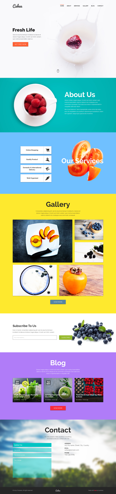

zadanie 2

Technika wykonania: HTML/SCSS/JS/Bootstrap 4.

Uwagi dodatkowe: 
- menu ma sie przyklejac do góry przy skrolowaniu (navbar-fixed-top) 
- po kliknieciu na odnosnik w menu ma plynnie przenosic do danej sekcji

<a href="https://rafalsiemieniuk.github.io/2_task/index.html">my feat</a>

szablon:
